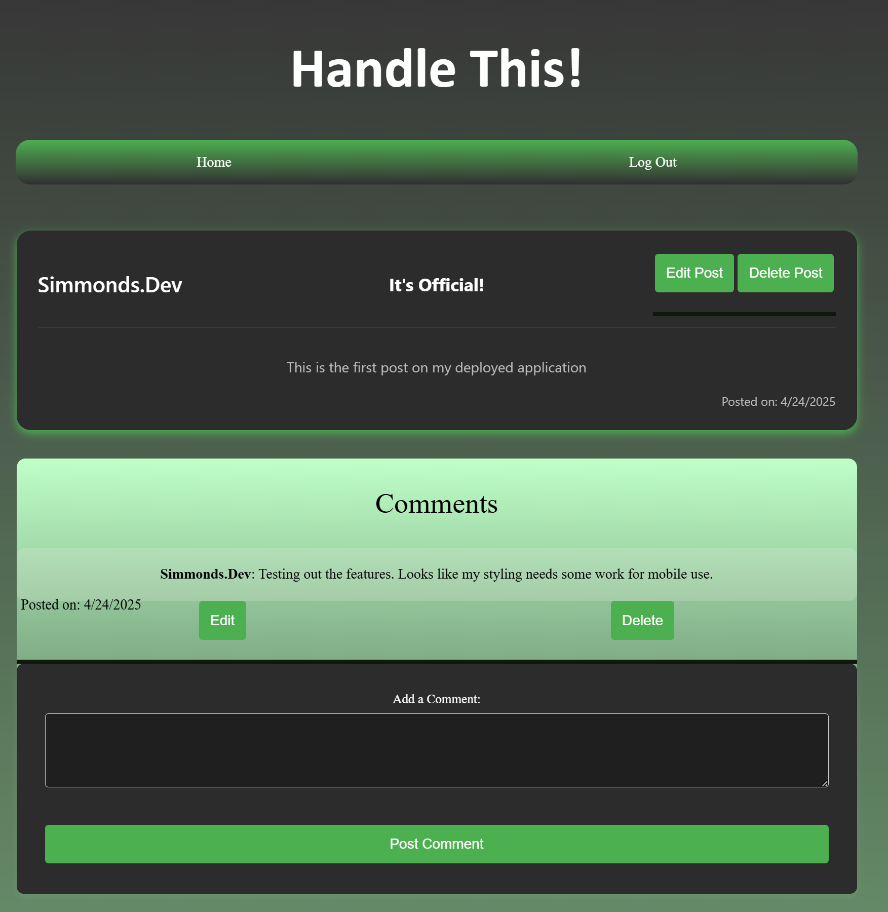

# Handle This!

A full-stack blog site where users can create posts, leave comments, and manage their content—all styled with a sleek, modern UI and deployed on Heroku.

## 🚀 Live Site

Check it out on Heroku: [Handle This!](https://handle-this-0664649bb26b.herokuapp.com/)

## 🛠️ Built With

- **Node.js** + **Express** for server-side logic
- **Sequelize** with **MySQL/PostgreSQL** for the database
- **Handlebars.js** for templating
- **express-session** for authentication
- **bcrypt** for password hashing
- **dotenv** for managing environment variables
- **Heroku** for deployment
- **Custom CSS** with media queries for responsive styling

## ✨ Features

- Sign up, log in, and log out securely
- Create, edit, and delete blog posts
- Add, edit, and delete comments
- Posts and comments tied to logged-in users
- Session-based authentication using `express-session`
- Responsive layout (currently being improved for mobile)

## 📸 Screenshot

This is the first official post on the deployed app:



## 🔧 Getting Started

To run this project locally:

1. Clone the repo
2. Run `npm install`
3. Create a `.env` file and add the following:
   ```env
   DBNAME=your_db_name
   DBUSER=your_username
   DBPASS=your_password
   SESSION_SECRET=your_secret
